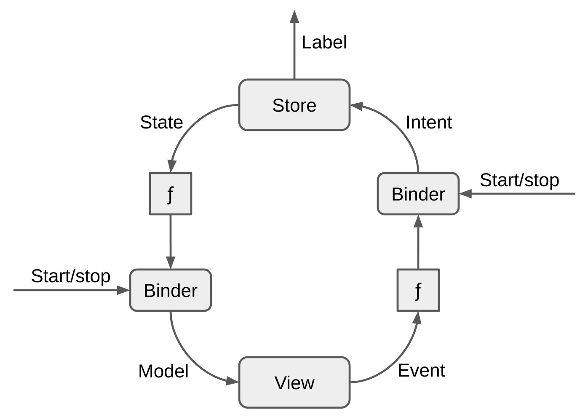

## Overview

### What is MVI

MVI stands for Model-View-Intent. It is an architectural pattern that utilizes unidirectional data flow. The data circulates between `Model` and `View` only in one direction - from `Model` to `View` and from `View` to `Model`.

### What is MVIKotlin

MVIKotlin is a Kotlin Multiplatform framework that provides a way of (not only) writing shared code using MVI pattern. It also includes powerful debug tools like logging and time travel.

### Core components

There are two core components in MVIKotlin: 

- `Store` - represents `Model` from MVI, this is the place for business logic
- `MviView` - represents `View` from MVI, the UI part

### How the data flows

Please take a look at the following diagram:

The `Store` produces a stream of `States` which is transformed to a stream of `View Models` by a `Mapper` function (f). The `View` renders `View Models` and produces a stream of `View Events` which is transformed to a stream of `Intents` by an another `Mapper` function (f). This makes the `Store` and the `View` independent from each other. You can also combine multiple `States` (multiple `Stores`) into a single `View Model` (single `View`), or multiple `View Events` (multiple `Views`) into a single `Intent` (single `Store`). But if you have only one `Store` and only one `View` and you need simplicity then your `View` can directly render `States` and produce `Intents`.

The `View` is subscribed to the stream of `View Models` and the `Store` is subscribed to the stream of `Intents` by a `Binder`. The `Binder` accepts `start` and `stop` signals and manages the subscribtions. The `Binder` is optional, you can subscribe components as you like. 

The `Store` also produces a stream of `Labels` - one time events. They can be transformed to `Intents` and redirected to another `Stores`. Or you can use them for routing or to display errors or for any other actions that are not so important to be part of the `State`.

The data flows between core components only on Main thread.

### Reactivity

MVI loves reactivity, it's all about data streams and transformations. MVIKotlin is a reactive framework. But the main functionality of the framework does not depend on any such a library. A tiny abstraction over Rx is used instead. Extensions for [Reaktive](https://github.com/badoo/Reaktive) and for [Coroutines](https://github.com/Kotlin/kotlinx.coroutines) libraries are provided as separate modules.

### Kotlin/Native

MVIKotlin is Kotlin/Native friendly and supports its tricky memory model (please read about Kotlin/Native [concurrency](https://kotlinlang.org/docs/reference/native/concurrency.html) and [immutability](https://kotlinlang.org/docs/reference/native/immutability.html) if you are unsure).

`Stores` are freezable, however you should be careful not to freeze any dependency that is not intended to be frozen. When you subscribe to a `Store` the subscriber will not be frozen, unless you switch threads somewhere down the stream.
